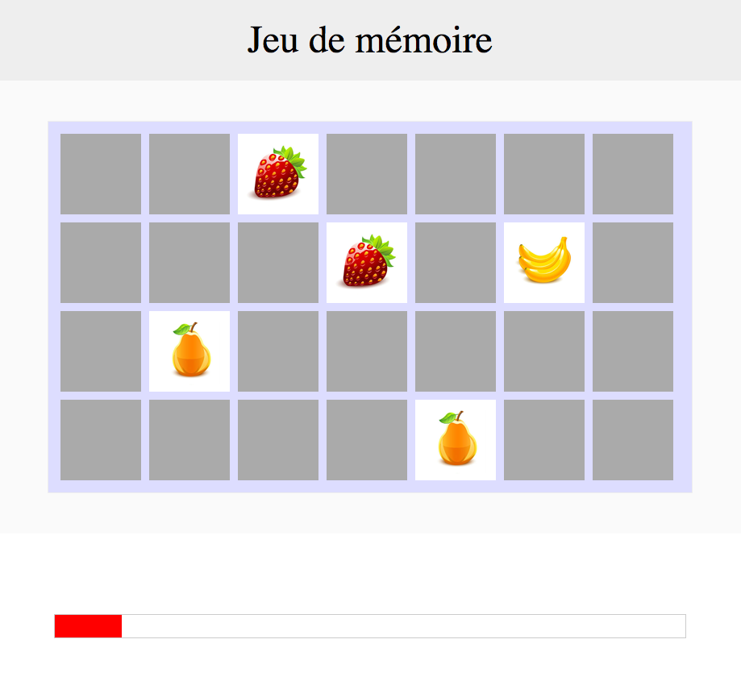

# Memory

Le but est de coder un mini-jeu en HTML / CSS / JS.  
Il s’agit du jeu “memory” :

* Des cartes sont disposées face cachée à l'écran.

* Le joueur doit cliquer sur deux cartes. Si celles-ci sont identiques, la paire est validée. Sinon, les cartes sont retournées face cachée, et le joueur doit sélectionner une nouvelle paire de cartes.

* Le joueur gagne s'il arrive à découvrir toutes les paires avant la fin du temps imparti.

