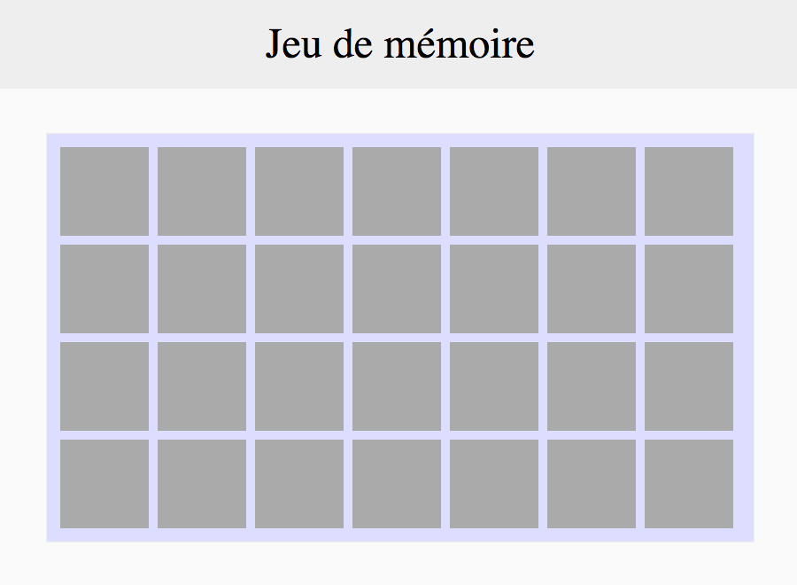

# On installe

On installe le plateau et les cartes

## Notions à utiliser

### HTML

- [Appeler une feuille de style CSS](https://developer.mozilla.org/fr/docs/Web/HTML/Element/link) [#](https://github.com/O-clock-Galaxy/correction-evaluation-js-memory/blob/master/index.html#L6)
- [Appeler un script Javascript](https://developer.mozilla.org/fr/docs/Web/HTML/Element/script) [#](https://github.com/O-clock-Galaxy/correction-evaluation-js-memory/blob/master/index.html#L23)

### CSS

- [Flexbox](https://css-tricks.com/snippets/css/a-guide-to-flexbox/) [#](https://github.com/O-clock-Galaxy/correction-evaluation-js-memory/blob/master/css/style.css#L20)

### JavaScript

- [`for`](https://developer.mozilla.org/fr/docs/Web/JavaScript/Reference/Instructions/for) [#](https://github.com/O-clock-Galaxy/correction-evaluation-js-memory/blob/master/js/app.js#L101)
- [`array`](https://developer.mozilla.org/fr/docs/Web/JavaScript/Reference/Objets_globaux/Array)  [#](https://github.com/O-clock-Galaxy/correction-evaluation-js-memory/blob/master/js/app.js#L159)
- [Création d'éléments DOM avec `jQuery("
")`](http://api.jquery.com/jQuery/#jQuery2)  [#](https://github.com/O-clock-Galaxy/correction-evaluation-js-memory/blob/master/js/app.js#L117)
- [Ajout d'éléments DOM enfants avec `jQuery.append()`](http://api.jquery.com/append/)  [#](https://github.com/O-clock-Galaxy/correction-evaluation-js-memory/blob/master/js/app.js#L132)

---

## Instructions

### Plateau

Le header et le plateau qui contient les cartes sont à créer directement en HTML / CSS.

### Cartes

Les 28 cartes, qu'on appellera `.carte`, doivent être créées en javascript à l'aide d'une boucle.
On *peut* stocker chacun des éléments créés dans un array, puis ajouter cet array au plateau.

Les `.carte` mesurent 100x100 pixels.

Chaque carte possède deux éléments enfants :
* la face cachée, qu’on appellera `.cache`.  
`.cache` est affiché et possède un fond gris.

* la face visible, qu’on appellera `.image`.  
`.image` est caché avec un fond blanc.

---

La suite : [On retourne](2_on-retourne.md)
