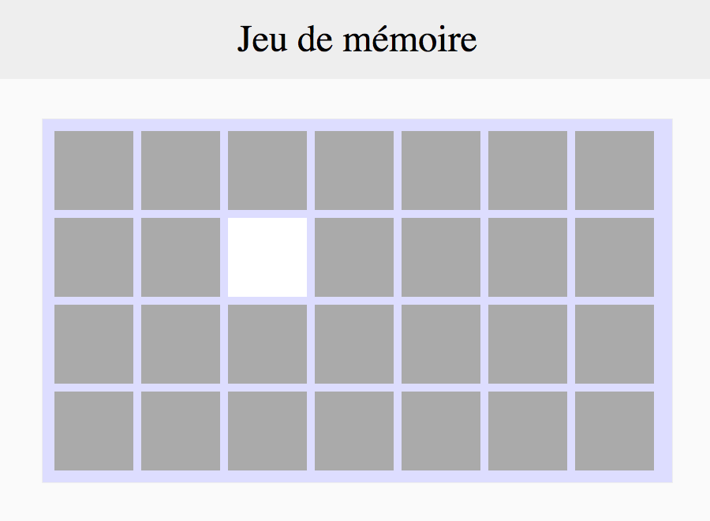

# On retourne !

Le joueur peut cliquer sur une carte pour la retourner.

## Notions à utiliser

### CSS

- [Sélecteur au survol de la souris d'un élément avec `:hover`](https://developer.mozilla.org/fr/docs/Web/CSS/%3Ahover) [#](https://github.com/O-clock-Galaxy/correction-evaluation-js-memory/blob/master/css/style.css#L70)

### JavaScript

- [Manipulation des classes d'un élément DOM avec jQuery](https://api.jquery.com/category/manipulation/class-attribute/) [#1](https://github.com/O-clock-Galaxy/correction-evaluation-js-memory/blob/master/js/app.js#L192)  [#2](https://github.com/O-clock-Galaxy/correction-evaluation-js-memory/blob/master/js/app.js#L230)
- [Ajout d'événements `click` sur un élément DOM avec jQuery](https://api.jquery.com/on/) [#](https://github.com/O-clock-Galaxy/correction-evaluation-js-memory/blob/master/js/app.js#L140)
- [Afficher ou cacher un élément DOM avec jQuery](https://api.jquery.com/category/effects/basics/) [#](https://github.com/O-clock-Galaxy/correction-evaluation-js-memory/blob/master/js/app.js#L194)

---

## Instructions

Au click sur une `.carte`, il faut masquer `.cache` et afficher `.image`.  
On peut faire ça en rajoutant une classe, ou en modifiant directement le style des éléments par exemple.

Pour un plus bel effet, on applique un gris plus foncé sur la carte au passage de la souris.

--

La suite : [La face visible](3_la-face-visible.md)
