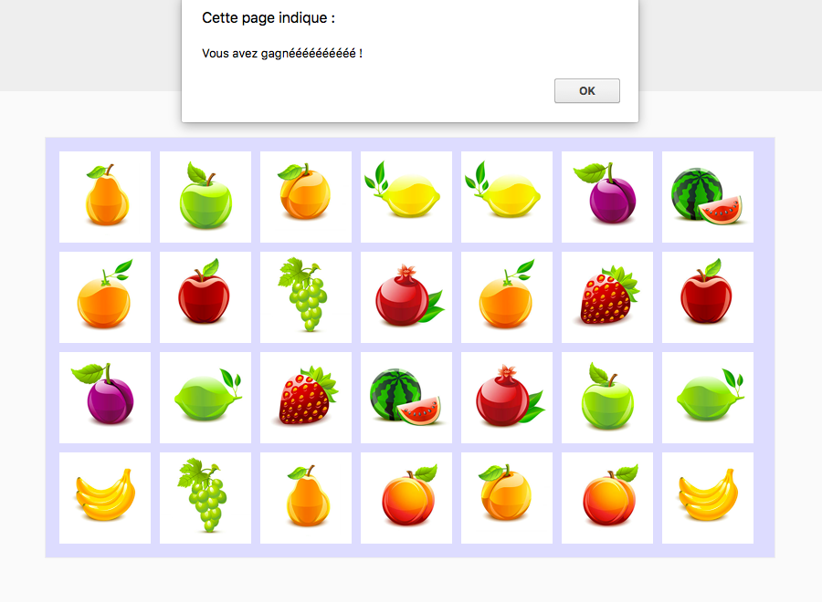

# Veni, vedi, vici.

Il faut vérifier si le joueur a gagné.

## Notions à utiliser

### JavaScript

- [Afficher un message avec `window.alert`](https://developer.mozilla.org/fr/docs/Web/API/Window/alert) [#](https://github.com/O-clock-Galaxy/correction-evaluation-js-memory/blob/master/js/app.js#L283)

---

## Instructions

* A chaque paire découverte, il faut tester si toutes les cartes ont été retournées.

* Si c’est le cas, on affiche un message, et on retourne à la page d’accueil.

--

La suite : [Compte à rebours](6_compte-a-rebours.md)
